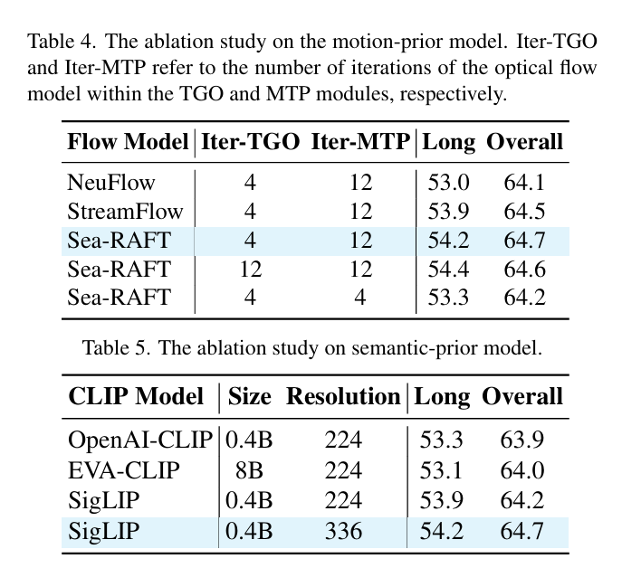

需要修改以下 要加入
Q1:
TGO(Temporal Granularity Optimization)
MTP( Motion Token Pruning)

要加進去消融實驗的結果

Q2:

查證完成。以下是完整結果。
查證結果
1. MetaSpatial 編號 ✅ 已查到
真實存在。arXiv 編號為 2503.18470,標題《MetaSpatial: Reinforcing 3D Spatial Reasoning in VLMs for the Metaverse》,作者 Zhenyu Pan 與 Han Liu,發表於 2025 年 3 月 24 日。它用 RL 強化 VLM 的 3D 空間推理,透過物理感知約束與渲染影像評估來最佳化佈局的連貫性、物理一致性與美感。可以把投影片裡「編號未查證」的註記更新為 2503.18470(已查證)。 arXivGitHub
2. 「optical flow reward GRPO」關鍵字 ✅ 投影片說法成立
搜到的「flow + GRPO」論文(FlowTTS-GRPO、Flow-Map GRPO、G2RPO、Pref-GRPO、Flow-GRPO…)裡的「flow」全都是指 flow-matching(生成模型的建模框架),不是光流(optical flow)。這正好印證投影片的核心結論:把「光流一致性當推理 reward」在搜尋範圍內確實少見。
3. 「motion consistency reward」關鍵字 ⚠️ 有需要修正的重要發現
這裡出現了與投影片「未見」說法有張力的證據,建議你特別注意:

AR-Drag(2510.08131):論文中明確有一條「motion consistency reward」,並顯示該 reward 在訓練中穩定上升、代表對齊改善。這是 RL(結合軌跡式 reward model)驅動的影片生成。 ResearchGate
GeoFlow(2605.18365):這篇最關鍵。它提出直接以「geometry-consistency reward」最佳化影片生成的幾何一致性,核心洞見是「時間上的幾何連貫性可透過運動分析來近似」,並衡量像素運動是否能被一個連貫的 3D 場景解釋。而且它改造了 Flow-GRPO 來做高解析度影片生成,透過同步噪聲初始化與截斷反傳,使 RL 微調在複雜幾何對齊上可行且穩定。這已經非常接近「以運動/光流一致性作為 GRPO reward」的概念。 arxivarxiv
GRPO Survey(2603.06623):在 Motion Control 分類下,直接列出了「Optical-flow discriminator」與「Geometry-verifiable 3D alignment reward」作為 motion control 的 reward 手段。 arxiv

建議修正
投影片說「flow 一致性當推理 reward 搜尋範圍內未見」——這在**「VLM 文字推理 reward」的語境下大致成立;但如果把範圍放到影片生成的 GRPO reward**,那麼 GeoFlow 的 geometry-consistency reward(以運動分析近似)、AR-Drag 的 motion consistency reward,以及 survey 明列的 optical-flow discriminator,都已經踩在這條線上。
換句話說,更精準的結論會是:**「以光流/運動一致性作為『文字推理』的 verifiable reward」尚未見到;但作為『影片生成』的 RL/GRPO reward 已有相當接近的先例(GeoFlow、AR-Drag)。**這比原本「未見」的說法更站得住腳,也把 GeoFlow 這個強力反例納入,避免被審閱者當場推翻。
需要的話,我可以幫你把這張投影片的三條 bullet 與底部註記改寫成已查證版本。

Q4
我來查證這兩個問題:各資料集的授權與規模,以及偽標(Depth Anything V2、RAFT/FlowSeek)在動態/遮擋場景下的誤差。重要發現:ARKitScenes 的授權是**非商用**。我繼續查合成資料集和偽標誤差。已掌握合成資料集的規模與授權。最後查偽標在動態/遮擋場景下的誤差,這是最關鍵的一項。查證完成,結果對這張投影片的兩個「未驗證」項目都有直接答案。以下是完整報告。

## 查證結果

### 問題一:授權條款

這是這張投影片**最需要修正**的地方——授權差異非常大,直接影響能不能做商用訓練。

| 資料集 | 授權 | 商用 GRPO 訓練可行性 |
|---|---|---|
| **ARKitScenes** | Apple 授權 | ⚠️ 在多篇論文中被明確歸為「Apple license」,且被列為非商用。OpenReview 上的授權條款寫明 Apple 授予的是「個人、非商用、非專屬」授權。**商用受限** |
| **ScanNet / ScanNet++** | 各自的 Terms of Use | ⚠️ 需簽署使用條款、通常限研究用途,**商用需另談** |
| **Spring** | CC BY 4.0 | ✅ Spring 的場景與資產取自 Blender 開源電影專案,以開放的 CC BY 4.0 授權釋出。**可商用**(需標註來源) |
| **FlyingThings3D** | 研究用途 | ⚠️ 學術資料集,商用不明確 |
| **Virtual KITTI 2** | CC BY-NC-SA(NAVER Labs) | ⚠️ 通常為**非商用** |
| **Dynamic Replica** | 需查(Meta 出品) | ⚠️ 多為研究用途 |

**關鍵結論**:投影片列的資料集中,只有 **Spring(CC BY 4.0)** 明確可商用;ARKitScenes、Virtual KITTI 2 等主力資料集都是**非商用/研究限定**。如果這個 GRPO 方法未來要落地成商業產品,**授權會是實質障礙**,不是小問題。這點必須在方法設計時就想清楚(例如:用 GT 資料只做「概念驗證」是可以的,但大規模訓練要靠可商用的偽標,見下)。

### 問題二:規模

規模基本上**不是問題**,證據充足:

- ARKitScenes 有 5,048 個 RGB-D 序列、1,661 個獨特場景,是當時最大的室內資料集,規模是既有最大室內資料集的三倍以上。
- 合成資料:FlyingThings3D 約有 96,336 幀、Virtual KITTI 2 約 84,840 幀、Spring 約 23,812 幀,都是數萬到十萬量級的稠密標註幀。
- 真正的規模來源是**偽標**:Depth Anything V2 可對任意影片產生深度,理論上規模無上限。

所以「規模是否足夠」的答案是:**GT 資料足以驗證概念,偽標足以擴到任意規模。規模不是瓶頸,授權才是。**

### 問題三:偽標在動態/遮擋場景的誤差(最關鍵風險)

這一項的查證結果**強烈支持投影片的擔憂**——偽標在動態/遮擋場景確實有系統性誤差,而且是已知的痛點:

**Depth Anything V2 的動態場景問題:**
- 它主要是為靜態影像設計,在影片中會出現閃爍(flickering)與運動模糊(motion blur)。這正是「動態場景誤差」的直接證據。
- V2 的訓練標註本身在幾個關鍵情況下是錯的:透明、反射、細structure、精細邊界;而用 SfM 產生的標註在移動物體(人、車)上會失敗,產生稀疏、殘缺、充滿離群值的深度圖,模型會忠實地學會這些盲點。
- 此外 V2 輸出的是相對深度而非度量深度(metric),這限制了需要度量座標的下游用途——對「一致性 reward」而言,相對深度的尺度漂移也是噪音來源。

**光流(RAFT 類)的誤差傳播:**
- 依賴光流做時間對齊的深度方法,其表現會受到光流或位姿估計不準確的誤差所拖累。
- 依賴光流的一致性約束模組,會對光流本身的誤差敏感。

**遮擋與動態本質上的困難:**
- 目前用重投影誤差的自監督深度預測方法不適用於動態場景,關鍵難點在於如何分離靜態與動態物體。
- 要對含任意移動物體的動態場景估計時間一致的深度,是一個「欠約束(underconstrained)」問題——這是數學本質上的困難,不是工程調參能完全解決的。

### 總結:對投影片的建議修正

你這張投影片的**「未驗證」聲明方向是對的,而且比原本寫的更嚴重**,建議這樣修正:

1. **授權**(需上修為明確風險):不是「未查」,而是「已查、且確有問題」。主力資料集 ARKitScenes、Virtual KITTI 2 為**非商用**,只有 Spring 可商用。建議改寫為:「GT 資料多為研究/非商用授權(僅 Spring 為 CC BY 4.0),商用落地需以可商用偽標為主力。」

2. **規模**:可以放心,GT 足以驗證概念、偽標可無限擴充,不是瓶頸。

3. **偽標誤差**(核心風險,已被文獻坐實):投影片說「未量化」是誠實的,但可以補一句更強的話——**這不只是「未量化」,而是「已知的系統性失效模式」**:Depth Anything V2 在動態場景會閃爍、在移動物體/透明/反射上標註本就錯誤;光流一致性約束會放大光流本身的誤差;動態場景的一致深度在數學上是欠約束問題。

換句話說,「偽標錯 → reward 錯」不是一個假設性風險,而是**文獻已反覆記錄的現象**。這反而是你這個研究**必須設計對策**(例如遮擋遮罩、動態區域降權、用合成 GT 校準偽標噪音)的最強理由——把它從「待辦查證」升級成「方法的核心貢獻點」,論證會更有力。

需要的話,我可以幫你把 Q4 這張投影片的四條 bullet 與底部「未驗證」註記,改寫成納入以上查證結果的版本。
在Q8　4D 常見 benchmark 及彼此差異(評測用;訓練資料見 Q4)。

必須把每一個benchmark都要加進去連結 就是時機資料及的連結要付上

另外幫我加入一頁頁樹幫我統整C:\Users\julia\Desktop\4D\slides\TDL_7頁回答.pptx和C:\Users\julia\Desktop\4D\slides\4D_evidence_reward_deep.pptx 所以用到的視覺語言型?
